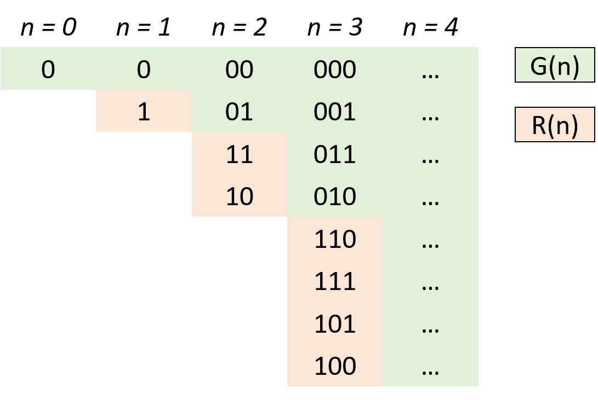

[43. 字符串相乘](#43-字符串相乘)

### int相关

​	[7. 整数反转](#7-整数反转)

​	[8. 字符串转换整数 (atoi)](#8-字符串转换整数(atoi))

​	[9. 回文数](#9-回文数)


### 进制相关

​	[89. 格雷编码](#89-格雷编码)


### [43. 字符串相乘](https://leetcode-cn.com/problems/multiply-strings/)

Difficulty: **中等**


给定两个以字符串形式表示的非负整数 `num1` 和 `num2`，返回 `num1` 和 `num2` 的乘积，它们的乘积也表示为字符串形式。

**示例 1:**

```
输入: num1 = "2", num2 = "3"
输出: "6"
```

**示例 2:**

```
输入: num1 = "123", num2 = "456"
输出: "56088"
```

**说明：**

1.  `num1` 和 `num2` 的长度小于110。
2.  `num1` 和 `num2` 只包含数字 `0-9`。
3.  `num1` 和 `num2` 均不以零开头，除非是数字 0 本身。
4.  **不能使用任何标准库的大数类型（比如 BigInteger）**或**直接将输入转换为整数来处理**。


```java
public String multiply(String num1, String num2) {
    if (num1.equals("0") || num2.equals("0")) {
        return "0";
    }
    int[] res = new int[num1.length() + num2.length()];
    for (int i = num1.length() - 1; i >= 0; i--) {
        int n1 = num1.charAt(i) - '0';
        for (int j = num2.length() - 1; j >= 0; j--) {
            int n2 = num2.charAt(j) - '0';
            int sum = (res[i + j + 1] + n1 * n2);
            res[i + j + 1] = sum % 10;
            res[i + j] += sum / 10;
        }
    }

    StringBuilder result = new StringBuilder();
    for (int i = 0; i < res.length; i++) {
        if (i == 0 && res[i] == 0) {
            continue;
        }
        result.append(res[i]);
    }
    return result.toString();
}

作者：breezean
链接：https://leetcode-cn.com/problems/multiply-strings/solution/you-hua-ban-shu-shi-da-bai-994-by-breezean/
```


## int相关

### [7. 整数反转](https://leetcode-cn.com/problems/reverse-integer/)

Difficulty: **简单**


给你一个 32 位的有符号整数 `x` ，返回 `x` 中每位上的数字反转后的结果。

如果反转后整数超过 32 位的有符号整数的范围 [−2<sup>31</sup>,  2<sup>31 </sup>− 1] ，就返回 0。

**假设环境不允许存储 64 位整数（有符号或无符号）。**

**示例 1：**

```
输入：x = 123
输出：321
```

**示例 2：**

```
输入：x = -123
输出：-321
```

**示例 3：**

```
输入：x = 120
输出：21
```

**示例 4：**

```
输入：x = 0
输出：0
```

**提示：**

* -2<sup>31</sup> <= x <= 2<sup>31</sup> - 1

**思路：**题目要求不允许使用long，只能用int。需要在乘之前进行是否越界的判断。

对于负数的取模和求余运算，直接用绝对值运算，算完了把符号加上。

```java
public int reverse(int x) {
    int res = 0;
    while (x != 0) {
        int num = x % 10;
        //正数
        if (res > Integer.MAX_VALUE / 10 || (res == Integer.MAX_VALUE / 10 && num > 7)){
            return 0;
        }
        //负数
        if (res < Integer.MIN_VALUE / 10 || (res == Integer.MIN_VALUE / 10 && num < -8)){
            return 0;
        }
        res = res * 10 + num;
        x /= 10;
    }
    return res;
}
```

相关高频题：

[9. 回文数](#9-回文数)

[8. 字符串转换整数 (atoi)](#8-字符串转换整数(atoi))


### [8. 字符串转换整数(atoi)](https://leetcode-cn.com/problems/string-to-integer-atoi/)

Difficulty: **中等**


请你来实现一个 `myAtoi(string s)` 函数，使其能将字符串转换成一个 32 位有符号整数（类似 C/C++ 中的 `atoi` 函数）。

函数 `myAtoi(string s)` 的算法如下：

*   读入字符串并丢弃无用的前导空格
*   检查下一个字符（假设还未到字符末尾）为正还是负号，读取该字符（如果有）。 确定最终结果是负数还是正数。 如果两者都不存在，则假定结果为正。
*   读入下一个字符，直到到达下一个非数字字符或到达输入的结尾。字符串的其余部分将被忽略。
*   将前面步骤读入的这些数字转换为整数（即，"123" -> 123， "0032" -> 32）。如果没有读入数字，则整数为 `0` 。必要时更改符号（从步骤 2 开始）。
*   如果整数数超过 32 位有符号整数范围 [−2<sup>31</sup>,  2<sup>31 </sup>− 1] ，需要截断这个整数，使其保持在这个范围内。具体来说，小于 −2<sup>31</sup> 的整数应该被固定为−2<sup>31</sup> ，大于2<sup>31 </sup>− 1 的整数应该被固定为`2<sup>31 </sup>− 1 。
*   返回整数作为最终结果。

**注意：**

*   本题中的空白字符只包括空格字符 `' '` 。
*   除前导空格或数字后的其余字符串外，**请勿忽略** 任何其他字符。

**示例 1：**

```
输入：s = "42"
输出：42
解释：加粗的字符串为已经读入的字符，插入符号是当前读取的字符。
第 1 步："42"（当前没有读入字符，因为没有前导空格）
         ^
第 2 步："42"（当前没有读入字符，因为这里不存在 '-' 或者 '+'）
         ^
第 3 步："42"（读入 "42"）
           ^
解析得到整数 42 。
由于 "42" 在范围 [-231, 231 - 1] 内，最终结果为 42 。
```

**示例 2：**

```
输入：s = "   -42"
输出：-42
解释：
第 1 步："   -42"（读入前导空格，但忽视掉）
            ^
第 2 步："   -42"（读入 '-' 字符，所以结果应该是负数）
             ^
第 3 步："   -42"（读入 "42"）
               ^
解析得到整数 -42 。
由于 "-42" 在范围 [-231, 231 - 1] 内，最终结果为 -42 。
```

**示例 3：**

```
输入：s = "4193 with words"
输出：4193
解释：
第 1 步："4193 with words"（当前没有读入字符，因为没有前导空格）
         ^
第 2 步："4193 with words"（当前没有读入字符，因为这里不存在 '-' 或者 '+'）
         ^
第 3 步："4193 with words"（读入 "4193"；由于下一个字符不是一个数字，所以读入停止）
             ^
解析得到整数 4193 。
由于 "4193" 在范围 [-231, 231 - 1] 内，最终结果为 4193 。
```

**示例 4：**

```
输入：s = "words and 987"
输出：0
解释：
第 1 步："words and 987"（当前没有读入字符，因为没有前导空格）
         ^
第 2 步："words and 987"（当前没有读入字符，因为这里不存在 '-' 或者 '+'）
         ^
第 3 步："words and 987"（由于当前字符 'w' 不是一个数字，所以读入停止）
         ^
解析得到整数 0 ，因为没有读入任何数字。
由于 0 在范围 [-231, 231 - 1] 内，最终结果为 0 。
```

**示例 5：**

```
输入：s = "-91283472332"
输出：-2147483648
解释：
第 1 步："-91283472332"（当前没有读入字符，因为没有前导空格）
         ^
第 2 步："-91283472332"（读入 '-' 字符，所以结果应该是负数）
          ^
第 3 步："-91283472332"（读入 "91283472332"）
                     ^
解析得到整数 -91283472332 。
由于 -91283472332 小于范围 [-231, 231 - 1] 的下界，最终结果被截断为 -231 = -2147483648 。
```

**提示：**

*   `0 <= s.length <= 200`
*   `s` 由英文字母（大写和小写）、数字（`0-9`）、`' '`、`'+'`、`'-'` 和 `'.'` 组成

**方法1：迭代。考虑到各种极端情况。**

判断越界这里参考Java Integer.parseInt()，提供与[7. 整数反转](#7-整数反转)不同的一种方法：用减法，`res = (res * 10) - digit`。然后用负数做边界：`(res * 10) - digit >= limit`是对的，移项：`res >= (limit + digit) / 10`是对的，否则说明越界。

```java
public int myAtoi(String str) {
    if ((str == null) || (str.length() <= 0)) {
        return 0;
    }
    int res = 0;
    int index = 0;
    //过滤空格
    while ((index < str.length()) && (str.charAt(index) == ' ')) {
        index++;
    }
    if (index == str.length()) {
        return 0;
    }
    //取正负号
    char firstChar = str.charAt(index);
    boolean positive = true;
    if (!isDigit(firstChar)) {
        if ((firstChar != '+') && (firstChar != '-')) {
            return 0;
        }
        index++;
        positive = firstChar != '-';
    }
    //用负数保存正负数的边界，这样不会溢出
    //正数 -2147483647
    //负数 -2147483648
    int limit = positive ? (-Integer.MAX_VALUE) : Integer.MIN_VALUE;
    //过滤0
    while ((index < str.length()) && (str.charAt(index) == '0')) {
        index++;
    }
    //取每一位,在非字符截止
    while ((index < str.length()) && isDigit(str.charAt(index))) {
        int digit = str.charAt(index++) - '0';
        if (res < ((limit + digit) / 10)) {
            return positive ? Integer.MAX_VALUE : Integer.MIN_VALUE;
        }
        //这里的res>=limit
        res = (res * 10) - digit; //用减法
    }
    return positive ? (-res) : res;
}

public boolean isDigit(char c) {
    return (c >= '0') && (c <= '9');
}
```

方法二：[有限状态机](#8-字符串转换整数(atoi))，参考力扣题解。


### [9. 回文数](https://leetcode-cn.com/problems/palindrome-number/)

Difficulty: **简单**


给你一个整数 `x` ，如果 `x` 是一个回文整数，返回 `true` ；否则，返回 `false` 。

回文数是指正序（从左向右）和倒序（从右向左）读都是一样的整数。例如，`121` 是回文，而 `123` 不是。

**示例 1：**

```
输入：x = 121
输出：true
```

**示例 2：**

```
输入：x = -121
输出：false
解释：从左向右读, 为 -121 。 从右向左读, 为 121- 。因此它不是一个回文数。
```

**示例 3：**

```
输入：x = 10
输出：false
解释：从右向左读, 为 01 。因此它不是一个回文数。
```

**示例 4：**

```
输入：x = -101
输出：false
```

**提示：**

*   -2<sup>31</sup> <= x <= 2<sup>31</sup> - 1

**进阶：**你能不将整数转为字符串来解决这个问题吗？

**思路：**做过[7. 整数反转](#7-整数反转)，可以反转整数然后判断是否相等。不过类比[234. 回文链表](./链表.md/#234-回文链表)或[125. 验证回文串](./字符串.md/#125-验证回文串)，不需要完全反转，只需要反转一半即可，前面一半等于后面一半的反转。

```java
public boolean isPalindrome(int x) {
    if (x < 0 || (x != 0 && x % 10 == 0)) {
        return false;
    }
    int res = 0;
    while (x > res) {
        res = res * 10 + x % 10;
        x = x / 10;
    }
    //x有偶数位：x == res  x有奇数位：x == res / 10
    return (x == res || x == res / 10);
}
```


## 进制相关

### [89. 格雷编码](https://leetcode-cn.com/problems/gray-code/)

Difficulty: **中等**


格雷编码是一个二进制数字系统，在该系统中，两个连续的数值仅有一个位数的差异。

给定一个代表编码总位数的非负整数 _n_，打印其格雷编码序列。即使有多个不同答案，你也只需要返回其中一种。

格雷编码序列必须以 0 开头。

**示例 1:**

```
输入: 2
输出: [0,1,3,2]
解释:
00 - 0
01 - 1
11 - 3
10 - 2

对于给定的 n，其格雷编码序列并不唯一。
例如，[0,2,3,1] 也是一个有效的格雷编码序列。

00 - 0
10 - 2
11 - 3
01 - 1
```

**示例 2:**

```
输入: 0
输出: [0]
解释: 我们定义格雷编码序列必须以 0 开头。
     给定编码总位数为 n 的格雷编码序列，其长度为 2n。当 n = 0 时，长度为 20 = 1。
     因此，当 n = 0 时，其格雷编码序列为 [0]。
```

**思路：找规律，给list中现有元素添加1<<n**



```java
public List<Integer> grayCode(int n) {
    List<Integer> res = new ArrayList<Integer>() {{
        add(0);
    }};
    int head = 1;
    for (int i = 0; i < n; i++) {
        for (int j = res.size() - 1; j >= 0; j--){
            res.add(head + res.get(j));
        }
        head <<= 1;
    }
    return res;
}
```

