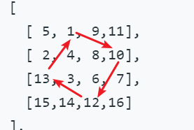

### 二维数组

[54. 螺旋矩阵](#54-螺旋矩阵)

[48. 旋转图像](#48-旋转图像)


## 二维数组

### [54. 螺旋矩阵](https://leetcode-cn.com/problems/spiral-matrix/)

**相同题：[剑指 Offer 29. 顺时针打印矩阵](https://leetcode-cn.com/problems/shun-shi-zhen-da-yin-ju-zhen-lcof/)**

Difficulty: **中等**


给你一个 `m` 行 `n` 列的矩阵 `matrix` ，请按照 **顺时针螺旋顺序** ，返回矩阵中的所有元素。

**示例 1：**


```
输入：matrix = [[1,2,3],[4,5,6],[7,8,9]]
输出：[1,2,3,6,9,8,7,4,5]
```

**示例 2：**


```
输入：matrix = [[1,2,3,4],[5,6,7,8],[9,10,11,12]]
输出：[1,2,3,4,8,12,11,10,9,5,6,7]
```

**提示：**

*   `m == matrix.length`
*   `n == matrix[i].length`
*   `1 <= m, n <= 10`
*   `-100 <= matrix[i][j] <= 100`

**思路：维护上下左右四个变量指针，注意判断，避免`left = right`或`top = bottom`时重复。**而且如图1中，从左右是3个数，从上往下是2个数，从右往左是2个数，从下往上只有一个数。

```java
public List<Integer> spiralOrder(int[][] matrix) {
    ArrayList<Integer> list = new ArrayList<>();
    if (matrix.length == 0) {
        return list;
    }
    int top = 0;
    int bottom = matrix.length - 1;
    int left = 0;
    int right = matrix[0].length - 1;
    while (top <= bottom && left <= right) {
        for (int i = left; i <= right; i++) {
            list.add(matrix[top][i]);
        }
        for (int i = top + 1; i <= bottom; i++) {
            list.add(matrix[i][right]);
        }
        //小心重复
        if (bottom != top) {
            for (int i = right - 1; i >= left; i--) {
                list.add(matrix[bottom][i]);
            }
        }
        //小心重复
        if (right != left) {
            for (int i = bottom - 1; i >= top + 1; i--) {
                list.add(matrix[i][left]);
            }
        }
        top++;
        bottom--;
        left++;
        right--;  //这一行不要忘了
    }
    return list;
}
```

走一行走一列就立即修改，这样更简单。

```java
public List<Integer> spiralOrder(int[][] matrix) {
    ArrayList<Integer> list = new ArrayList<>();
    if (matrix.length == 0) {
        return list;
    }
    int top = 0;
    int bottom = matrix.length - 1;
    int left = 0;
    int right = matrix[0].length - 1;
    while (top <= bottom && left <= right) {
        for (int i = left; i <= right; i++) {
            list.add(matrix[top][i]);
        }
        top++;
        for (int i = top; i <= bottom; i++) {
            list.add(matrix[i][right]);
        }
        right--;
        //小心重复

        for (int i = right; i >= left; i--) {
            list.add(matrix[bottom][i]);
        }
        bottom--;

        //小心重复
        for (int i = bottom; i >= top; i--) {
            list.add(matrix[i][left]);
        }
        left++;
    }
    return list;
}
```

[59. 螺旋矩阵 II](https://leetcode-cn.com/problems/spiral-matrix-ii/)方法和这道题一样。


### [48. 旋转图像](https://leetcode-cn.com/problems/rotate-image/)

Difficulty: **中等**


给定一个 `n × n` 的二维矩阵 `matrix` 表示一个图像。请你将图像顺时针旋转 90 度。

你必须在 旋转图像，这意味着你需要直接修改输入的二维矩阵。**请不要** 使用另一个矩阵来旋转图像。

**示例 1：**


```
输入：matrix = [[1,2,3],[4,5,6],[7,8,9]]
输出：[[7,4,1],[8,5,2],[9,6,3]]
```

**示例 2：**


```
输入：matrix = [[5,1,9,11],[2,4,8,10],[13,3,6,7],[15,14,12,16]]
输出：[[15,13,2,5],[14,3,4,1],[12,6,8,9],[16,7,10,11]]
```

**示例 3：**

```
输入：matrix = [[1]]
输出：[[1]]
```

**示例 4：**

```
输入：matrix = [[1,2],[3,4]]
输出：[[3,1],[4,2]]
```

**提示：**

*   `matrix.length == n`
*   `matrix[i].length == n`
*   `1 <= n <= 20`
*   `-1000 <= matrix[i][j] <= 1000`

**方法1：先按对角线反转，再每行逆序。**

```java
public void rotate(int[][] matrix) {
    int n = matrix.length;
    // 先以对角线（左上-右下）为轴进行翻转
    for (int i = 0; i < n - 1; i++) {
        for (int j = i + 1; j < n; j++) {
            int tmp = matrix[i][j];
            matrix[i][j] = matrix[j][i];
            matrix[j][i] = tmp;
        }
    }
    // 再对每一行以中点进行翻转
    int mid = n >> 1;
    for (int i = 0; i < n; i++) {
        for (int j = 0; j < mid; j++) {
            int tmp = matrix[i][j];
            matrix[i][j] = matrix[i][n - 1 - j];
            matrix[i][n - 1 - j] = tmp;
        }
    }
}
```

**方法2：先按对角线反转，再每行逆序。**



任意一个`(i,j) , (j, n-i-1), (n-i-1, n-j-1), (n -j-1, i)`就是这四个索引号上的数交换。

```java
public void rotate(int[][] matrix) {
    int n = matrix.length;
    for (int i = 0; i < n / 2; i++) {
        for (int j = i; j < n - i - 1; j++) {
            int tmp = matrix[i][j];
            matrix[i][j] = matrix[n - j - 1][i];
            matrix[n - j - 1][i] = matrix[n - i - 1][n - j - 1];
            matrix[n - i - 1][n - j - 1] = matrix[j][n - i - 1];
            matrix[j][n - i - 1] = tmp;
        }
    }
}
作者：powcai
链接：https://leetcode-cn.com/problems/rotate-image/solution/yi-ci-xing-jiao-huan-by-powcai/
```

**疑问：如果按逆时针旋转呢？**

一样的，先按主对角线旋转，再按列逆序。